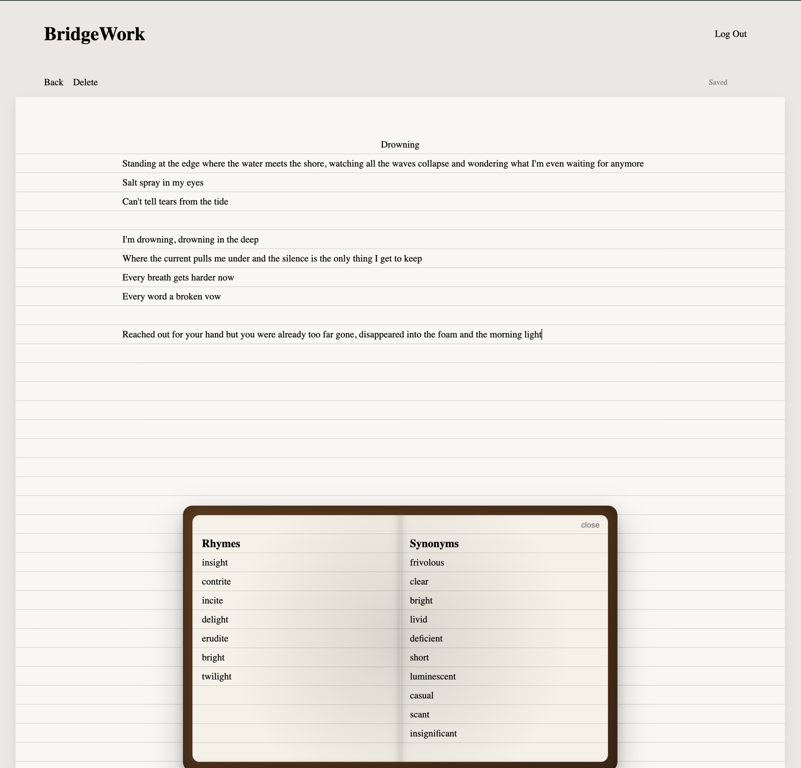

# BridgeWork

A lightweight songwriting assistant that provides real-time rhyme and synonym suggestions as you write. 
No more toggling between tabs to find the right word.

## Tech Stack
- Go (Backend)
- HTML/CSS/JavaScript (Frontend)
- Postgres (Database)

## Current Features
- Signup/activation/login/logout lifecycle
- Text editor with autosave
- Dynamic rhyme and synonym recommendations

## Known Limitations
- Basic rhyme and synonym filtering logic
- No text formatting or theme customization options
- No caching of rhymes and synonyms on backend
- No collaboration or export features

## Planned Features
- Smarter rhyme and synonym suggestions
- AI brainstorm that offers thematic directions
- Caching rhymes and synonyms on backend
- Real-time collaboration
- Multiple themes/customizations
- Upload song audio to loop while writing
- Record melody ideas for lines
- Pre-made labels such as Verse, Chorus, etc
- Add chords above lyric lines

